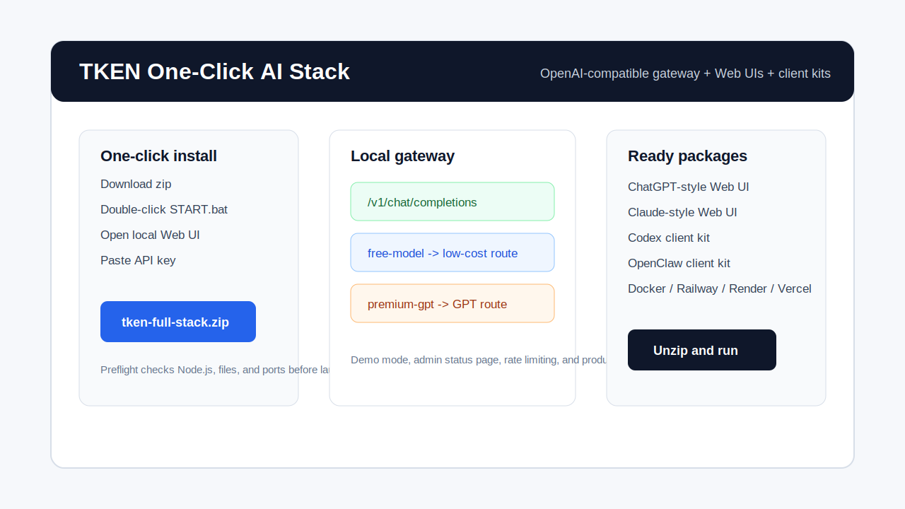

# TKEN One-Click AI Stack

[](https://vercel.com/new/clone?repository-url=https://github.com/vivian254338489/tken-one-click-ai-stack&env=LOCAL_API_KEY,UPSTREAM_API_KEY,UPSTREAM_BASE_URL,FREE_MODEL,PREMIUM_MODEL,DEFAULT_ROUTE&envDescription=OpenAI-compatible%20gateway%20settings&envLink=https://www.tken.shop/?utm_source=github%26utm_medium=deploy_button%26utm_campaign=one_click_ai_stack)



Six ready-to-run install packages for an OpenAI-compatible multi-model AI stack.

- One-click AI gateway
- One-click ChatGPT-style Web UI
- One-click Claude-style Web UI
- Codex client config kit
- OpenClaw client config kit
- Docker, Railway, Render, and Vercel deployment files

Pick a zip, unzip it, and run. No framework migration, no vendor lock-in.

After unzipping, non-technical users can open `START_HERE.txt`.

For non-technical users: download `tken-full-stack.zip`, unzip it, double-click `START.bat`, then open `http://localhost:8787/chatgpt`.

The start scripts also try to open the browser automatically.

The start scripts run a preflight check first. If Node.js is missing, the port is busy, or files are incomplete, the package prints a clear fix before it starts.

Default API base URL:

```text
https://www.tken.shop/v1
```

Get an API key:

https://www.tken.shop/?utm_source=github&utm_medium=readme&utm_campaign=one_click_ai_stack

## Direct Download

Latest release:

https://github.com/vivian254338489/tken-one-click-ai-stack/releases/latest

Not sure which package to choose? Open `DOWNLOADS.md`.

| Need | Download |
| --- | --- |
| Everything: gateway, ChatGPT-style UI, Claude-style UI, client kits | [`tken-full-stack.zip`](https://github.com/vivian254338489/tken-one-click-ai-stack/releases/latest/download/tken-full-stack.zip) |
| Only the OpenAI-compatible gateway | [`tken-gateway.zip`](https://github.com/vivian254338489/tken-one-click-ai-stack/releases/latest/download/tken-gateway.zip) |
| ChatGPT-style standalone UI | [`tken-chatgpt-web-ui.zip`](https://github.com/vivian254338489/tken-one-click-ai-stack/releases/latest/download/tken-chatgpt-web-ui.zip) |
| Claude-style standalone UI | [`tken-claude-web-ui.zip`](https://github.com/vivian254338489/tken-one-click-ai-stack/releases/latest/download/tken-claude-web-ui.zip) |
| Codex config kit | [`tken-codex-client-kit.zip`](https://github.com/vivian254338489/tken-one-click-ai-stack/releases/latest/download/tken-codex-client-kit.zip) |
| OpenClaw config kit | [`tken-openclaw-client-kit.zip`](https://github.com/vivian254338489/tken-one-click-ai-stack/releases/latest/download/tken-openclaw-client-kit.zip) |

Verify downloads with:

```text
https://github.com/vivian254338489/tken-one-click-ai-stack/releases/latest/download/SHA256SUMS.txt
```

Build locally only if you want to modify the source:

```bash
npm install
npm run check:kits
```

## Important Naming Note

This project is not affiliated with OpenAI, Anthropic, ChatGPT, Claude, Codex, or OpenClaw.

The terms "ChatGPT-style" and "Claude-style" describe UI patterns only. You can connect any OpenAI-compatible provider.

## Install Package Matrix

| Package | Path | What it installs | Deploy targets |
| --- | --- | --- | --- |
| Full stack | `.` | Gateway plus bundled ChatGPT-style and Claude-style UIs | Node, Docker, Railway, Render, Vercel |
| Gateway | `.` | OpenAI-compatible `/v1/chat/completions` proxy and route mapper | Node, Docker, Railway, Render, Vercel |
| ChatGPT Web UI | `apps/chatgpt-web` | Standalone browser UI | Node, Docker, Vercel/static hosts |
| Claude Web UI | `apps/claude-web` | Standalone browser UI | Node, Docker, Vercel/static hosts |
| Codex client kit | `clients/codex` | Generic Codex-style provider config generator | Local client config |
| OpenClaw client kit | `clients/openclaw` | Generic OpenClaw-style provider config generator | Local client config |

See `MANIFEST.md` for the full file manifest.

The first run uses demo mode by default. The UI works immediately without an upstream key. For real models, set `UPSTREAM_API_KEY` and `DEMO_MODE=false`.

`.env` is loaded automatically when you run `npm start`.

## Why Developers Star This

- OpenAI-compatible endpoint shape, so existing tools can connect quickly.
- Local route names for low-cost and premium models.
- Two familiar web UIs without a heavy frontend build step.
- Real deployment files for Docker, Railway, Render, and Vercel.
- Demo mode, setup wizard, admin status page, and production readiness check.
- Preflight checks for Node.js, required files, and local port conflicts.
- Safe support reports in the full stack, standalone Web UIs, and client kits.
- SEO-ready comparison pages and growth drafts for GitHub, Reddit, video, and marketplace experiments.
- API cost calculator and UTM builder for measurable promotion campaigns.
- Deployable GPT tutorial, Claude tutorial, and AI tools navigation site templates.
- Built-in request rate limiting and basic security headers for public deployments.
- Zip packages are validated after build, so users can unzip and run.

## Fastest Start

Windows:

```text
Double-click START.bat
```

macOS/Linux:

```bash
sh START.sh
```

Manual:

```bash
npm install
npm run setup
npm start
```

Interactive setup:

```bash
npm run wizard
npm start
```

Preflight only:

```bash
npm run preflight
```

Generate a safe support report:

```bash
npm run support:report
```

Windows users can also double-click `SUPPORT.bat`. macOS/Linux users can run `sh SUPPORT.sh`.

Production check before sharing with real users:

```bash
npm run production:check
```

Open:

- ChatGPT-style UI: http://localhost:8787/chatgpt
- Claude-style UI: http://localhost:8787/claude
- Admin status page: http://localhost:8787/admin
- Gateway health: http://localhost:8787/health

Windows one-step installer:

```powershell
.\install\install.ps1
```

macOS/Linux one-step installer:

```bash
sh install/install.sh
```

## Docker Start

Gateway plus bundled UIs:

```bash
cp .env.example .env
docker compose up --build
```

Full multi-package stack:

```bash
cp .env.example .env
docker compose -f docker-compose.full.yml up --build
```

Ports:

| Service | URL |
| --- | --- |
| Gateway and bundled UIs | http://localhost:8787 |
| Standalone ChatGPT Web UI | http://localhost:8788 |
| Standalone Claude Web UI | http://localhost:8789 |

## Gateway Routes

| Route | Purpose |
| --- | --- |
| `/v1/chat/completions` | OpenAI-compatible gateway endpoint |
| `/v1/models` | Local route list in OpenAI-style format |
| `/chatgpt` | Bundled ChatGPT-style UI |
| `/claude` | Bundled Claude-style UI |
| `/config/public` | Public model route config for bundled UIs |
| `/health` | Health check |

## Model Routing

Users can send local model route names such as `free-model` and `premium-gpt`. The gateway maps those names to upstream model IDs:

```env
FREE_MODEL=your_free_or_low_cost_model
PREMIUM_MODEL=your_premium_gpt_model
DEFAULT_ROUTE=free-model
MODEL_ROUTES={"qwen-fast":"your_qwen_model","deepseek-chat":"your_deepseek_model"}
```

Use the low-cost route for simple extraction, summarization, formatting, and drafts. Use the premium route for coding, hard reasoning, and final critical answers.

## Standalone Web UIs

ChatGPT-style UI:

```bash
cd apps/chatgpt-web
npm install
npm start
```

Claude-style UI:

```bash
cd apps/claude-web
npm install
npm start
```

Each standalone UI reads `public/config.js`:

```js
window.TKEN_WEB_CONFIG = {
  apiBaseUrl: "https://www.tken.shop/v1",
  defaultModel: "tken-free-model",
  models: [
    { id: "tken-free-model", label: "Low-cost model" },
    { id: "premium-gpt-model", label: "Premium GPT route" }
  ]
};
```

Standalone Web UI users can generate a safe support report with:

```bash
npm run support:report
```

## Client Kits

Codex config generator:

```bash
cd clients/codex
node install.mjs
```

OpenClaw config generator:

```bash
cd clients/openclaw
node install.mjs
```

Generated files are written to each package's `generated/` folder.

Client kit users can double-click `SUPPORT.bat` or run `sh SUPPORT.sh` to generate `generated/support-report.json`.

## Cloud Deploy

- Docker: `deploy/docker.md`
- Railway: `deploy/railway.md`
- Render: `deploy/render.md`
- Vercel: `deploy/vercel.md`

## More

- `DOWNLOADS.md`
- `START_HERE.txt`
- `QUICKSTART.md`
- `growth/content-calendar.md`
- `growth/github-fork-targets.md`
- `growth/seo-site-network-plan.md`
- `growth/distribution-matrix.md`
- `growth/approved-action-queue.md`
- `growth/short-video-scripts.md`
- `site-templates/`
- `COMMERCIAL.md`
- `FAQ.md`
- `ROADMAP.md`
- `DEMO.md`
- `TROUBLESHOOTING.md`
- `RELEASE.md`
- `CONTRIBUTING.md`
- `LAUNCH_CHECKLIST.md`

## Build Downloadable Packages

```bash
npm install
npm run package:kits
```

Generated zip packages:

- `dist/tken-full-stack.zip`
- `dist/tken-gateway.zip`
- `dist/tken-chatgpt-web-ui.zip`
- `dist/tken-claude-web-ui.zip`
- `dist/tken-codex-client-kit.zip`
- `dist/tken-openclaw-client-kit.zip`

Each zip contains its own README and beginner entry point. Windows users can start with `START.bat` where applicable.

## Verify

```bash
npm run check
npm run check:kits
```

The check starts the gateway, verifies the bundled UIs and config routes, and confirms required package files exist.

## Example API Call

```bash
curl https://www.tken.shop/v1/chat/completions \
  -H "Authorization: Bearer $TKEN_API_KEY" \
  -H "Content-Type: application/json" \
  -d '{
    "model": "tken-free-model",
    "messages": [{"role":"user","content":"Say hello in one sentence."}]
  }'
```

## License

MIT
